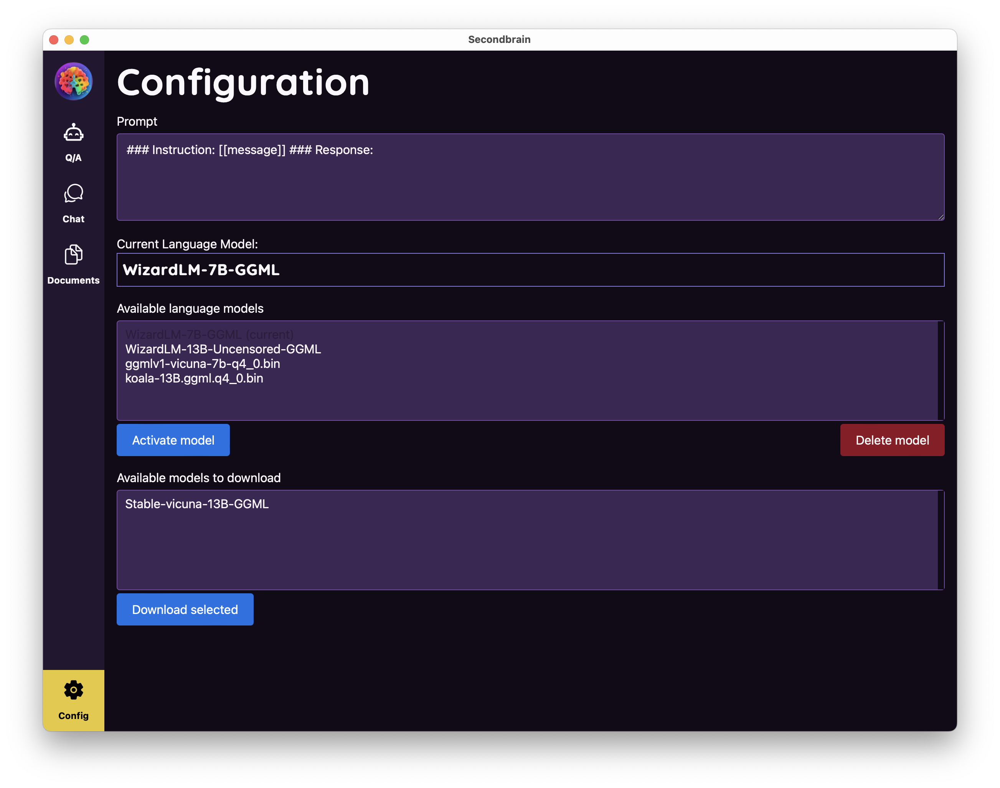

<p align="center">

</p>
<p align="center">

</p>

<h2 align="center">
Multi-platform desktop app to download and run Large Language Models(LLM) locally in your computer
</h2>
<br/>
<p align="center">
  
</p>

<p align="center">
  <a href="https://secondbrain.sh" target="_blank">
    🔗 Download
  </a>
    &nbsp; | &nbsp; Give it a Star ⭐ | &nbsp;
    <a href="https://twitter.com/intent/tweet?text=If you want to easily download and use local LLMs, try this app: https://github.com/juliooa/secondbrain/" target="_blank">
      Share it on Twitter 🐦
    </a>
</p>

# Features

- 🚀 The power of AI in your computer
- 💻 Local - it can work without internet
- 🔒 Privacy first - your messages don't leave your computer
- 🤫 Uncensored - you can talk whatever you want
- 📖 Open source

# Try the app

If you just want to get the app installers and try the app, go to <a href="https://secondbrain.sh" target="_blank">secondbrain.sh</a>.

# How to use

The first time you open the app you will need to download a model, and then activate it.

## Download a model

Secondbrain comes with some models ready to download, that we know work. You can check, or modify, the [models.json](/src-tauri/configs/models.json) to see their details.


You can also add your own model files to the `/models` folder, and then activate them from within Secondbrain app. The model needs to be in `ggml` format.

## Activate the model

Just select the model and press "Activate model", and you are ready to start using the model.

## The prompt is important

Language models are predictive machines, you throw some words(tokens actually) at them and they try to predict what is the most likely token to come after that, and after that new one, and so on.
Not all the models work so smooth as ChatGPT, it depends on the pre-training, the fine-tuning, and the under-the-hood prompting.

When using models you need to take into account what format they understand better, for example `Alpaca` models were trained with [this format](https://github.com/tatsu-lab/stanford_alpaca#data-release):

```
Below is an instruction that describes a task. Write a response that appropriately completes the request.

### Instruction:
{instruction}

### Response:
```

So, if you want to download and use your own models, take into account the prompt and change it in the configuration screen.

With foundational models, like Llama, things get crazy, there is no fine-tuning, so finally you can flex your prompt engineering skills and play around.

# How to run from source

The app is build with Tauri, so basically you need to follow this guide: https://tauri.app/v1/guides/getting-started/prerequisites/

# Techstack

- [ggml](https://github.com/ggerganov/ggml)
- [llm](https://github.com/rustformers/llm)
- [Rust](https://www.rust-lang.org/)
- [Tauri](https://tauri.app/)
- [SvelteKit](https://kit.svelte.dev/)
- [Skeleton](https://www.skeleton.dev/)

# Contribution

Yes, please. Just send your PRs.

Gracias 🤓

# Contact

Hi! you can find me here [@julioandresdev](https://twitter.com/julioandresdev)
